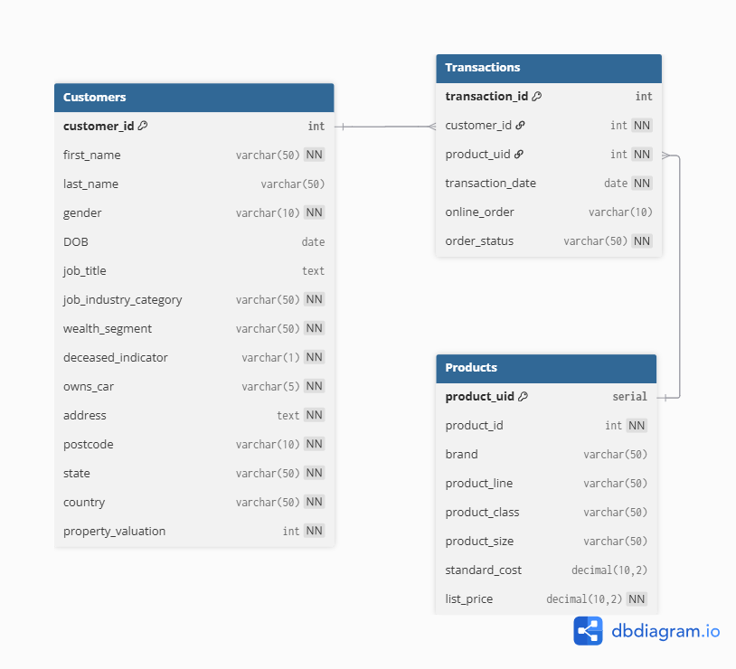
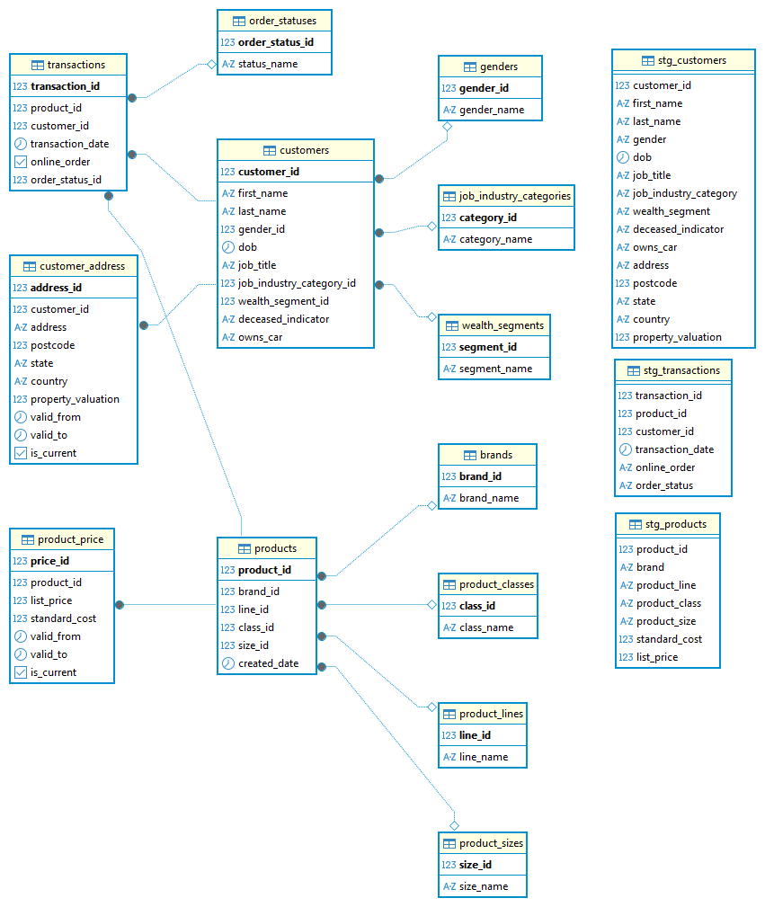

# 🌐 DB Homework  
### Нормализация данных до 3NF — Домашнее задание №1

<p align="left">
  
  
  
  
  
</p>

---

## 🔄 Нормализация от 1НФ до 3НФ

Исходно был один файл `customer_and_transaction.csv`, где в одной таблице смешивались данные о клиентах, продуктах и транзакциях. Ниже — как шаг за шагом эта структура была приведена к 3НФ.

---

### 1НФ — приведение к табличному виду

**Нарушения в исходном файле:**
- в одной строке хранились атрибуты разных сущностей (клиент, продукт, транзакция);
- типы данных не соответствовали смыслу (даты и булевы поля как текст);
- дублировались клиенты и продукты.

**Что было сделано:**
1. Файл был логически разделен на три таблицы-источника:
   - `stg_customers` (данные о клиентах),
   - `stg_products` (данные о продуктах),
   - `stg_transactions` (данные о транзакциях).
2. Для каждой таблицы выделены первичные ключи:
   - `stg_customers.customer_id`,
   - `stg_products.product_id`,
   - `stg_transactions.transaction_id`.
3. Приведены типы данных (дата рождения и дата транзакции в `DATE`, цены в `NUMERIC`, флаги в `TEXT`/`BOOLEAN`).
4. Удалены полные дубликаты строк.

На этом шаге каждая таблица удовлетворяет 1НФ: все значения атомарные, нет повторяющихся групп, определены ключи.

---

### 2НФ — разбиение по сущностям и устранение лишней зависимости от ключа

Далее анализировались функциональные зависимости в таблицах-источниках.

#### 2НФ для клиентов

В `stg_customers` ключом является `customer_id`.  
При этом поля адреса (address, postcode, state, country, property_valuation) логически образуют отдельную сущность «адрес клиента», которая может меняться во времени.

**Нарушение:** часть атрибутов зависит не только от клиента, но и от варианта адреса.

**Решение:**
- создана таблица `customers` с устойчивыми атрибутами клиента  
  (`customer_id`, `first_name`, `last_name`, `gender_id`, `dob`, `job_title`,
  `job_industry_category_id`, `wealth_segment_id`, `deceased_indicator`, `owns_car`);
- создана таблица `customer_address` с адресной информацией  
  (`address_id`, `customer_id`, `address`, `postcode`, `state`,
  `country`, `property_valuation`, `valid_from`, `valid_to`, `is_current`).

Теперь атрибуты клиента зависят только от `customer_id`, а адрес — от `address_id` и связанного `customer_id`.

#### 2НФ для продуктов

В `stg_products` ключ — `product_id`.  
Поля `brand`, `product_line`, `product_class`, `product_size` имеют повторяющиеся значения, которые используются для многих товаров.

**Нарушение:** в одной таблице смешаны сущности товар и его справочники, что приводит к избыточности.

**Решение:**
- создана таблица `products`  
  (`product_id`, `brand_id`, `line_id`, `class_id`, `size_id`, `created_date`);
- созданы lookup-таблицы:
  - `brands (brand_id, brand_name)`,
  - `product_lines (line_id, line_name)`,
  - `product_classes (class_id, class_name)`,
  - `product_sizes (size_id, size_name)`.

Зависимости: `product_id → brand_id, line_id, class_id, size_id`, а сами атрибуты бренда и т. д. хранятся отдельно.

#### 2НФ для транзакций

В `stg_transactions` ключ — `transaction_id`.  
Строка описывает одну покупку товара одним покупателем в определенную дату.

Семантически от транзакции зависят:
- `product_id`,
- `customer_id`,
- `transaction_date`,
- `online_order`,
- `order_status`.

**Нарушение:** `order_status` является справочником, а не атрибутом конкретной транзакции.

**Решение:**
- создана таблица `transactions`  
  (`transaction_id`, `product_id`, `customer_id`, `transaction_date`, `online_order`, `order_status_id`);
- создана таблица `order_statuses (order_status_id, status_name)`.

---

### 3НФ — устранение транзитивных зависимостей

На этом шаге убирались зависимости вида «поле зависит не от ключа, а от другого неключевого поля».

#### Клиенты

В исходных данных текстовые поля `gender`, `job_industry_category`, `wealth_segment` имеют ограниченный набор значений и встречаются много раз.

**Зависимости:**
- `gender_id → gender_name`,
- `job_industry_category_id → category_name`,
- `wealth_segment_id → segment_name`.

**Решение:**
- таблица `genders (gender_id, gender_name)`;
- таблица `job_industry_categories (category_id, category_name)`;
- таблица `wealth_segments (segment_id, segment_name)`.

В таблице `customers` хранятся только ссылки `gender_id`, `job_industry_category_id`, `wealth_segment_id`, а сами названия — в отдельных таблицах.

#### Продукты и цены

Цены меняются во времени и зависят от товара и периода действия, а не от структуры товара.

**Исходная проблема:** хранить `list_price` и `standard_cost` в `products` — значит смешивать характеристики товара и его ценовую историю.

**Решение:**
- из `products` цены вынесены в таблицу `product_price`  
  (`price_id`, `product_id`, `list_price`, `standard_cost`, `valid_from`, `valid_to`, `is_current`).

Теперь:
- `product_id` определяет структуру товара (бренд, линия, размер, класс);
- `price_id` определяет конкретный период действия цены для товара.

#### Адреса

Для адресов введены поля `valid_from`, `valid_to`, `is_current`.  
Адресные атрибуты зависят только от `address_id` и не имеют транзитивных зависимостей между собой.

---

### Основные зависимости в итоговой схеме

- `customers.customer_id →` все атрибуты клиента и внешние ключи  
  (`gender_id`, `job_industry_category_id`, `wealth_segment_id`).
- `customer_address.address_id →` адрес, индекс, штат, страна, оценка недвижимости и период действия.
- `products.product_id →` `brand_id`, `line_id`, `class_id`, `size_id`, `created_date`.
- `product_price.price_id →` `product_id`, `list_price`, `standard_cost`, период действия.
- `transactions.transaction_id →` `customer_id`, `product_id`, `transaction_date`, `online_order`, `order_status_id`.
- справочники (`genders`, `brands`, `product_lines`, `product_classes`,
  `product_sizes`, `job_industry_categories`, `wealth_segments`, `order_statuses`) содержат только ключ и наименование.

---

### Вывод

1. Структура последовательно приведена от 1НФ (очищенные staging-таблицы) к 2НФ (выделены отдельные сущности и справочники) и далее к 3НФ (убраны транзитивные зависимости и разделены сущности «структура», «адрес», «цена», «статусы»).
2. В итоговой схеме каждая неключевая колонка зависит только от своего ключа и не зависит от других неключевых атрибутов.
3. Такая модель уменьшает дублирование данных, упрощает обновление справочников и делает дальнейший анализ (по клиентам, товарам, ценам и транзакциям) более прозрачным и надежным.


---

## 📊 Схема базы данных

### Первоначальная диаграмма (dbdiagram)



### Финальная диаграмма (DBeaver)



---

## 📁 Структура репозитория

```text
DB_homework/
│
├── data/
│   ├── DB_customer.csv
│   ├── DB_product.csv
│   └── DB_transaction.csv
│
├── img/
│   ├── dbeaver_diagram.png
│   ├── dbeaver_structure.jpg
│   └── dbdiagram_на_уровне_проектирования.png
│
├── sql/
│   ├── 01_create_tables_and_lookups.sql
│   └── 02_load_data.sql
│
├── README.md
│
└── Вайс_Федор_ДЗ_1.ipynb
